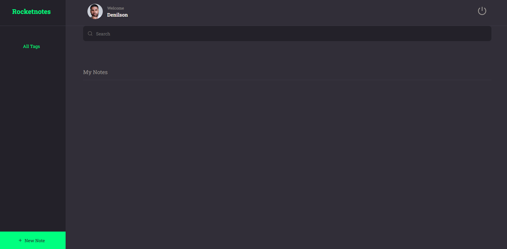
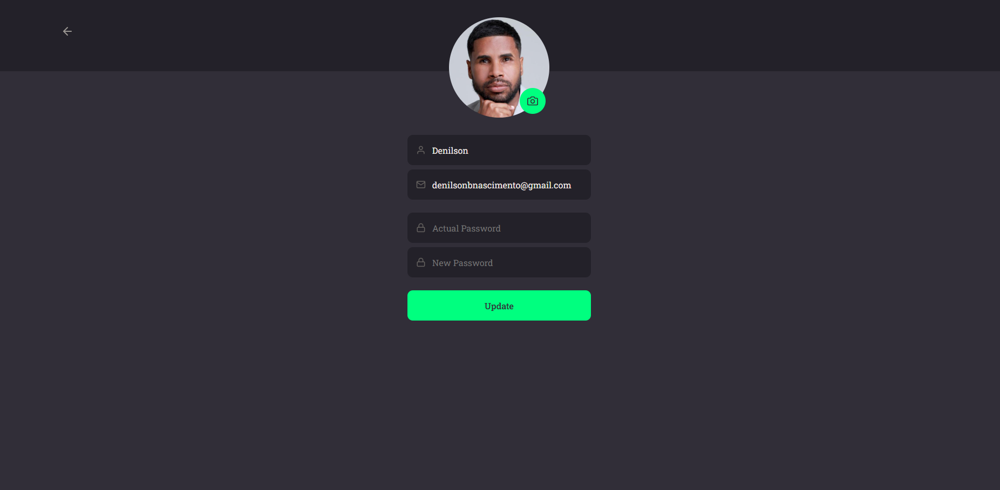
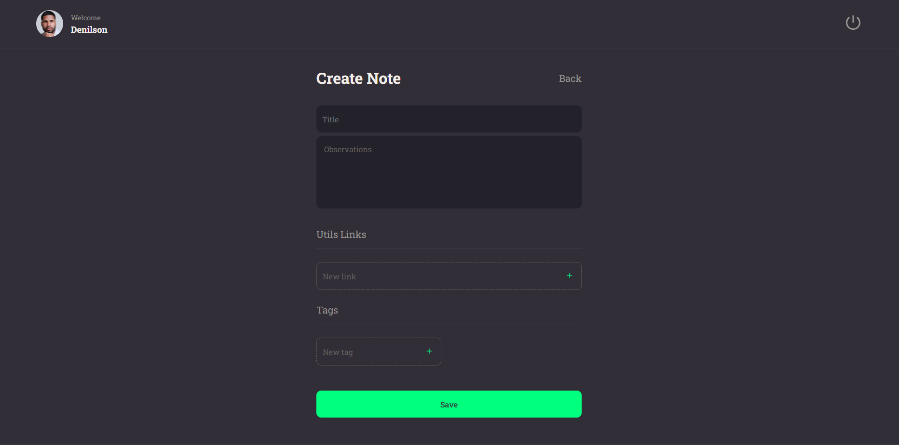

<h1 align="center">🌐 RocketNotes</h1>


<p align="center">É a parte Front-End de uma aplicação Full-Stack desenvolvido em React juntamente com Styled-Components!</p>
<br/>
<br/>
<p align="center">Utilizando React com vite e as dependências react-router-dom para implementação da troca das páginas, react-icons para estilização dos icones usando em toda a aplicação expecificamente a biblioteca FI e Styled-Components para ter o CSS diretamente no JavaScript. </p>
<br/>

<p align="center">Projeto desenvolvido durante o curso <strong>Explorer</strong> oferecida pela <a href="https://app.rocketseat.com.br/">RocketSeat</a>.<br/>
<br/>


<h1 align="center">⚙️ Principais telas</h1>


<h3 align="center">⭐ Perfil!</h3>

<p align="center">
  
</p>

<h3 align="center">⭐ Criação De Nota!</h3>
<p align="center">
  
</p>

<h3 align="center">⭐ Visualização da Nota!</h3>
<p align="center">
  
</p>


<h2 align="center">🧱 Pré-requisitos</h2>
<br/>

<p align="center">Antes de começar, você vai precisar ter instalado em sua máquina as seguintes ferramentas: <a href="https://git-scm.com">Git</a><br/>
Além disto é bom ter um editor para trabalhar com o código como <a href="https://code.visualstudio.com/">VSCode</a></p>
<br/>
<br/>
<h2 align="center">🎲 Rodando a aplicação</h2>
<br/>

<p align="center">

```bash
# Clone este repositório
$ git clone https://github.com/dsouloficial/Rocket-Notes-Front-end
$ npm install 
$ configure o package.json para utilizar o vite.

```
</p>
<br/>
<br/>

<h2 align="center">🛠 Tecnologias</h2>
<br/>

<p align="center">As seguintes ferramentas foram usadas na construção do projeto:<br/>
<br/>  
JavaScript - React - Styled-Components
<br/>
React-Icon - React-Router-Dom - Vite
<br/>
<br/>

<h1 align="center">📝 Licença</h1>

<p align="center">Este projeto esta sobe a licença MIT.</p>

<p align="center">Feito com ❤️ por Denilson Bernardo 👋🏽 <a href="https://www.linkedin.com/in/Denilson-Bernardo-profile/">Entre em Contato</a></p>


